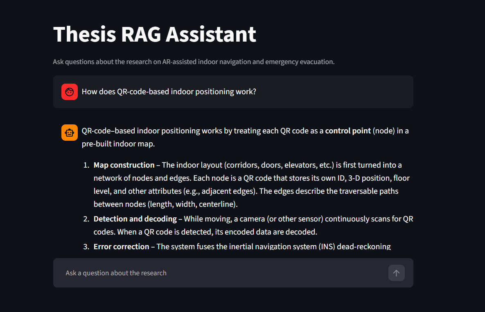

# Thesis RAG Assistant

A retrieval-augmented question-answering system over the research literature on AR-assisted indoor navigation and emergency evacuation. Ask a question in plain English and get an answer grounded in the source papers, with page-level citations.

**Live demo:** https://thesis-rag-assistant.streamlit.app/


Built as a portfolio project alongside my M.Sc. thesis on AR-assisted indoor navigation. The public demo runs over the published, open-access papers that underpin that thesis, so the questions and answers stay in a domain I know well.

## What it does

- Answers natural-language questions using semantic retrieval over a corpus of research papers, not keyword matching.
- Grounds every answer in the retrieved text and cites the source file and page.
- Says "I don't have that information" when the answer isn't in the documents, instead of inventing one.
- Offers suggested starter questions so a first-time visitor knows what to ask.

## How it works

The system has two phases.

**Indexing (once):** each PDF is loaded, split into ~1000-character overlapping chunks, embedded into 384-dimensional vectors with a local sentence-transformers model, and stored in a FAISS index alongside its source and page metadata.

**Querying (per question):** the question is embedded with the same model, the nearest chunks are retrieved from FAISS by cosine similarity, those chunks are inserted into a prompt with an instruction to answer only from the provided context, and a Groq-hosted LLM writes the grounded answer. The source pages of the retrieved chunks are shown as citations.

## Tech stack

| Layer        | Choice                                                 |
| ------------ | ------------------------------------------------------ |
| Embeddings   | sentence-transformers `all-MiniLM-L6-v2` (local, free) |
| Vector store | FAISS (`IndexFlatIP`, exact cosine search)             |
| Generation   | Groq API (`openai/gpt-oss-20b`)                        |
| Interface    | Streamlit                                              |
| Hosting      | Streamlit Community Cloud                              |

## Design decisions

- **RAG over a bare LLM** — grounding answers in retrieved source text is what keeps the model from hallucinating on a private, domain-specific corpus.
- **Local embeddings** — running the embedding model on-device keeps the pipeline free and means no document text is sent to a third party during indexing.
- **Citations and graceful failure** — the system reports which pages an answer came from and declines to answer when retrieval is weak, because a confidently wrong answer is worse than no answer.
- **Public open-access corpus** — the deployed demo uses only CC-BY / gold-open-access papers so the repository can be shared freely; my own thesis is kept private and never committed.

## Run it locally

```bash
git clone https://github.com/karthik-dixith/thesis-rag-assistant.git
cd thesis-rag-assistant
python -m venv .venv
.venv\Scripts\Activate.ps1        # Windows
pip install -r requirements.txt
```

```
Add a `.env` file with a free Groq API key:
```

```
GROQ_API_KEY=your_key_here
```

```
Put PDFs in `data/`, build the index, and run:
```

```bash
python build_index.py
streamlit run app.py
```

```
## Project structure

thesis-rag-assistant/
├── ingest.py # load PDFs, split into chunks
├── build_index.py # embed chunks, build and save the FAISS index
├── rag.py # retrieve, build prompt, generate cited answer
├── app.py # Streamlit chat interface
├── data/ # source PDFs
├── index/ # saved FAISS index and chunk metadata
└── requirements.txt
```

## Corpus and attribution

The demo is built over these open-access papers:

- Qiu, Mostafavi & Kalantari (2025), _Use of augmented reality in human wayfinding: A systematic review_ — Springer, open access.
- Valizadeh et al. (2024), _Indoor AR pedestrian navigation for emergency evacuation based on BIM and GIS_ — Heliyon, gold open access.
- Putra et al. (2025), _Adaptive AR navigation: real-time mapping using node placement and marker localization_ — MDPI Information, open access.
- Liu & Zhang (2023), _Indoor positioning and navigation based on QR code map_ — ISPRS Archives, CC BY.
- Kim et al. (2022), _A benchmark comparison of four off-the-shelf proprietary visual–inertial odometry systems_ — MDPI Sensors, open access.
- Zhu et al. (2025), _Semantics-based connectivity graph for indoor pathfinding powered by IFC-Graph_ — Cambridge Apollo, CC BY.

## Limitations and next steps

- Retrieval is pure vector similarity; a hybrid keyword + vector search with a reranking step would improve precision on exact terms.
- There is no automated evaluation harness yet; a faithfulness / answer-relevance evaluation is the next addition.
- Generation quality is bounded by the free-tier model; the model is a single configurable constant and can be swapped.
